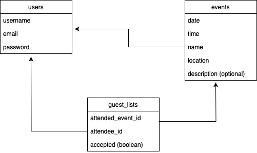

# Private Events - Rails app

This is a solution to the [Private Events](https://www.theodinproject.com/lessons/ruby-on-rails-private-events) project from [the Odin Project's](https://www.theodinproject.com) Rails path. 

## Features

User authentication via the Devise Gem. 

Displays events of two types: public and private. Public events are visible on the home page for anyone to view. Private events appear only on the pages of the creator and invitees. Any registered user may choose to add themselves to the guestlist of any public event. The creator of a private event determines the guestlist. Invited guests may accept or decline invitations to private events. 

Scopes are used to separate events into upcoming and past. 

## The database

## Screenshots

The home page when signed out. 

A user's page, with events displayed by category.

The page of a public event when user is signed out.

The page of a public event when user is signed in.

The page of a private event when user is creator.

The page where a private event's invites are set. 

### A note about guest lists

Guest lists to public and private events are treated differently.

For private events, there are essentially two components to creating a guest list: the invitation and the acceptance/rejection of an invitation. 

For the purposes of this app, invitations generated by the creator of a private event amount to entries in the guest lists through table of the form: attended_event_id, attendee_id, accepted: false.

To accept an invitation, an invited user updates the accepted column of the relevant guest list record to true.  

For public events, there is no invitation stage. Users may add themselves to an event's guest list (or remove themselves). This is handled by creating/destroying the record in the guest lists table. So, for public events, the accepted column is meaningless. 
